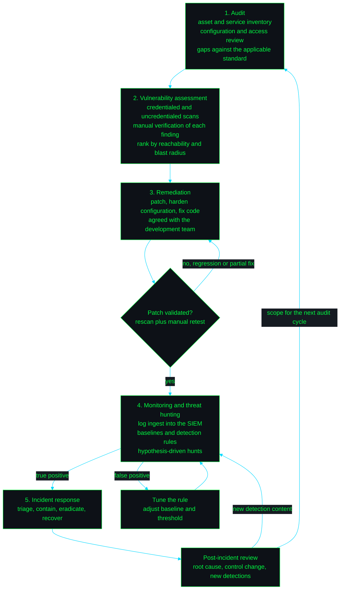

<!--
  This file belongs in the root of the repository erfzrezr/erfzrezr.

  Live links are filled in: LinkedIn (jihad-daab) and Credly (jihad-d).

  Deliberately absent, so that no badge points at an account that does not exist:
    - TryHackMe profile. The thm-haunting-writeup repository is still linked; only the
      profile badge is omitted.
    - Google Scholar. Commented out below. A Scholar author profile only exists once
      something of yours is indexed, so the badge would imply a publication record.
      Uncomment it on the first indexed output.
    - ORCID. Commented out below. Register one at https://orcid.org/register (it is free
      and valid with zero outputs), then uncomment the badge and paste the identifier.

  Rule for anything added later: delete the whole badge line rather than ship a link to a
  CHANGE-ME or an empty profile. A dead link costs more credibility than a missing badge.
-->

<div align="center">


   

</div>

---

## $ operator --profile

Cybersecurity engineer working in auditing, vulnerability management, and incident response.
Second-year PhD student in AI and cybersecurity. Based in Morocco.

**Mobiletic** · Jun 2023 to present · web security and development contractor, security lead and auditor

- Security monitoring and threat hunting across web development projects.
- System audits and vulnerability assessments, then remediation of the weaknesses found.
- Security controls integrated with the development teams and checked against industry standards.
- Configuration hardening and streamlined incident response protocols, which cut response time.
- Designed and implemented AI chatbot functionality that cut customer-support response time by 30%.

**Marjane** · Apr 2022 to May 2022 · technical support

- Troubleshooting of software, hardware, and network performance, improving system reliability.
- Maintenance of network security systems against configuration standards.
- Support for a range of network hardware and operating systems.

---

## $ tooling --by-phase

Tooling grouped by the phase of work it belongs to.

**recon and assessment**

  

**exploitation and validation**

   

**detection and response**

    

**research and machine learning**

  

**runtime**

   

Coverage is graded by depth so that paid work is not read as lab work.

```
COVERAGE SUMMARY                                                       subject: erfzrezr
----------------------------------------------------------------------------------------
ID      DOMAIN                          DEPTH     EVIDENCE
----------------------------------------------------------------------------------------
SEC-01  Web app penetration testing     primary   Mobiletic, web-app-pentest-methodology
SEC-02  Vulnerability management        primary   Mobiletic, Qualys Vulnerability
                                                  Detection and Response
SEC-03  Vulnerability patching          primary   Mobiletic, Qualys Patch Management
SEC-04  Information auditing            primary   Mobiletic
SEC-05  System and network security     primary   Mobiletic, Marjane
SEC-06  Threat hunting                  primary   Mobiletic
SEC-07  Incident response               primary   Mobiletic, soc-home-lab
SEC-08  SIEM operations and log review  working   soc-home-lab
SEC-09  Malware analysis                studied   self-study
SEC-10  Secure web development          primary   Mobiletic
SEC-11  AI and ML for security testing  research  ai-security-testing-platform
----------------------------------------------------------------------------------------
DEPTH   primary  = used in paid work
        working  = applied in lab or project context
        studied  = no published artefact yet
        research = active PhD work
----------------------------------------------------------------------------------------
```

---

## $ methodology --graph

The same loop drives audit work at Mobiletic and lab work at home. Patch validation gates the loop:
a fix that fails retest returns to remediation, and only a validated fix reaches monitoring.

<!--
  The diagram is deliberately dark-filled to match the badge palette. Mermaid blocks cannot be
  wrapped in <picture>, so there is no light-mode variant. Dark fill with a green border and green
  labels stays legible on GitHub's light canvas, and if the init directive is ever refused the
  flowchart still renders in GitHub's default mermaid theme.
-->



---

## $ research --status

PhD student, year 2. Field: AI and cybersecurity.

Direction: machine learning and reinforcement learning for automated vulnerability detection,
anomaly detection in application behaviour, and automated patch validation.

The `ai-security-testing-platform` repository below is the applied side of this work.

<!--
  Two research identifiers, both withheld until they point somewhere real.

  Google Scholar: uncomment on the first indexed publication. A Scholar author profile only
  exists once something of yours is indexed, so the badge would otherwise imply a publication
  record.

  ORCID: free to register at https://orcid.org/register and valid with zero outputs, so this
  is the one to switch on first. Paste the 16-digit identifier in place of the 0000 groups.

  <a href="https://scholar.google.com/citations?user=YOUR-SCHOLAR-ID"></a>
  <a href="https://orcid.org/0000-0000-0000-0000"></a>
-->

---

## $ ls projects/

| Repository | What is in it | Phase |
| --- | --- | --- |
| [ai-security-testing-platform](https://github.com/erfzrezr/ai-security-testing-platform) | ML and RL driven vulnerability detection, anomaly detection, automated patch validation | research |
| [soc-home-lab](https://github.com/erfzrezr/soc-home-lab) | Virtual SOC on Wazuh and Splunk, simulated attacks, event analysis | detection and response |
| [thm-haunting-writeup](https://github.com/erfzrezr/thm-haunting-writeup) | Full pentest lifecycle on a TryHackMe machine, recon through privilege escalation | exploitation and validation |
| [web-app-pentest-methodology](https://github.com/erfzrezr/web-app-pentest-methodology) | Repeatable web application assessment with Nmap, Burp Suite, OWASP ZAP | recon and assessment |

Repositories are published as each write-up is finished. Links resolve once the repo is public.

### AI-Powered Security and E2E Testing Platform

**Problem.** Manual security testing does not keep pace with release cadence, and a security fix
rarely gets a regression test of its own.

**Approach.** Machine learning and reinforcement learning drive vulnerability detection and the
exploration of end-to-end security testing workflows. Anomaly detection runs over application
behaviour. Patch validation is automated rather than manual.

**Outcome.** One pipeline covering detection, end-to-end testing, and patch validation, and the
applied half of the PhD work.

  

[github.com/erfzrezr/ai-security-testing-platform](https://github.com/erfzrezr/ai-security-testing-platform)

### SOC Home Lab

**Problem.** Detection engineering and alert triage need somewhere safe to fail, with attacks whose
ground truth is already known.

**Approach.** A virtual SOC with SIEM coverage using Wazuh and Splunk for log monitoring. Attacks are
simulated against lab hosts, then the resulting security events are analysed end to end.

```
 attack host  -->  lab endpoints  -->  agents  -->  Wazuh manager  -->  Splunk
 simulated TTPs    linux/windows       log ship     rules, alerts        dashboards
                                                    |
                                                    v
                                                    triage  -->  IR notes  -->  rule tuning
```

**Outcome.** A reusable environment for incident response practice, where every alert can be traced
back to the action that produced it.

 

[github.com/erfzrezr/soc-home-lab](https://github.com/erfzrezr/soc-home-lab)

### TryHackMe CTF, "Haunting"

**Problem.** A full penetration-testing lifecycle on an unfamiliar target, from first packet to root.
The machine is a public TryHackMe room, not a client system.

**Approach.** Reconnaissance and enumeration, exploitation of web vulnerabilities for the initial
foothold, then Linux privilege escalation to complete the chain.

**Outcome.** A write-up that records each step in order and the remediation for every weakness used
along the way.

  

[github.com/erfzrezr/thm-haunting-writeup](https://github.com/erfzrezr/thm-haunting-writeup)

### Web Application Penetration Testing

**Problem.** Web application assessments repeat the same ground. Without a written methodology the
coverage drifts from one assessment to the next.

**Approach.** Assessments run with Nmap, Burp Suite, and OWASP ZAP, documented as a repeatable
sequence rather than an ad hoc session.

**Outcome.** SQL injection, cross-site scripting, and authentication weaknesses identified, each
reported with reproduction steps and remediation guidance.

  

[github.com/erfzrezr/web-app-pentest-methodology](https://github.com/erfzrezr/web-app-pentest-methodology)

---

## $ cat certifications.txt

| Credential | Issuer | Status |
| --- | --- | --- |
| Certified Cybersecurity Technician, CCT | EC-Council | in progress |
| Vulnerability Detection and Response | Qualys | completed |
| Cybersecurity Asset Management | Qualys | completed |
| Patch Management | Qualys | completed |
| Web Application Scanning, WAS, self-paced course | Qualys | completed |
| Artificial Intelligence Analyst Certificate | IBM | completed |
| Cybersecurity Fundamentals | IBM | completed |
| Cybersecurity | Microsoft and LinkedIn | completed |

The EC-Council CCT is in preparation and not yet held.

<a href="https://www.credly.com/users/jihad-d"></a>

---

## $ cat education.txt

| Institution | Programme | Level |
| --- | --- | --- |
| UPF, Université Privée de Fès, Morocco | Computer Engineering, Ingénieur d'État | Bac+5 |
| Moulay Ismail, Morocco | Information Systems Development, Higher Technician | Bac+2 |
| Moulay Ismail, Morocco | Electrical Sciences and Technologies | Baccalaureate |

Languages: Arabic native, English advanced, French strong intermediate.

---

## $ git log --stat

<details>
<summary><b>Contribution stats</b></summary>

Commit history is thin. Most of the work above was done under contract or in a lab, and is being
rewritten into public repositories.


<!--
  Uncomment after roughly 3 months of real activity. At zero contributions these render empty and
  read worse than having no card at all.

  
  
  

  The metrics image is committed to the repository root by .github/workflows/metrics.yml. Its URL
  404s until that workflow has run at least once. Uncomment it after roughly 3 months of activity,
  on the same schedule as the cards above.

  
-->

</details>

---

## $ contact --list

<!--
  shields.io does not currently embed a logo for logo=linkedin (it returns the badge with the
  logo silently dropped), so the LinkedIn badge uses a green label stripe for the accent instead
  of a logo. Do not add logo=linkedin back unless you re-verify that it renders.

  The stripe depends on style=flat-square. Verified by live probe: under flat-square the badge
  is 67px with #00ff41 present, but under for-the-badge shields trims the whitespace label and
  the accent disappears silently. Do not switch this badge to for-the-badge.
-->

<a href="https://www.linkedin.com/in/jihad-daab"></a>
<a href="https://github.com/erfzrezr"></a>

Repositories:
[ai-security-testing-platform](https://github.com/erfzrezr/ai-security-testing-platform) ·
[soc-home-lab](https://github.com/erfzrezr/soc-home-lab) ·
[thm-haunting-writeup](https://github.com/erfzrezr/thm-haunting-writeup) ·
[web-app-pentest-methodology](https://github.com/erfzrezr/web-app-pentest-methodology)

Open to security engineering and AI-security research collaboration. Based in Morocco.

---

<!--
  The update-readme workflow replaces the single line between the two markers below with the
  current UTC date on every run. Keep each marker alone on its own line, and do not repeat
  either marker anywhere else in this file.
-->

<!-- LAST_UPDATED:START -->
Last updated: pending the first workflow run
<!-- LAST_UPDATED:END -->
